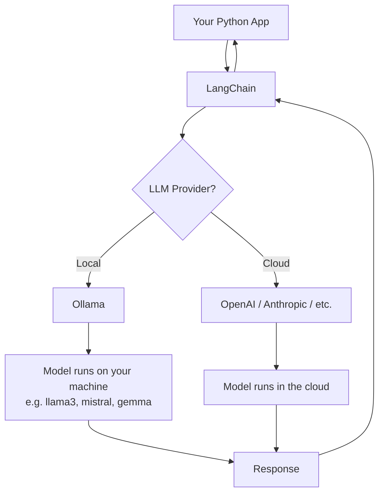

# LangChain + Ollama — How They Actually Fit Together

Let's get into local LLM development and understand how these two tools relate before writing a single line of code.

I spent time mapping out how LangChain and Ollama are connected, got the setup running, explored observability tools, and compared LangChain against LlamaIndex.

At first I thought LangChain and Ollama were kind of doing the same thing — or that one replaced the other. After actually setting things up, I realized they live at completely different layers.

## 1. LangChain + Ollama — The Relationship

These two tools are not competitors. They solve different problems.

- **Ollama** = runs LLMs locally on your machine. It spins up a local server at `localhost:11434` and handles the model execution.
- **LangChain** = a framework for *building* with LLMs. It handles how you structure prompts, chain calls together, add memory, use tools, and so on.

The way I think about it now:

> Ollama is the engine. LangChain is the steering wheel.

Here's the architecture that finally made it click:



What's useful about this setup: you get the full LangChain ecosystem — chains, agents, tools, memory — but the model itself never leaves your machine.

## 2. Installation

Getting this running requires a few packages. The non-obvious part:

```bash
pip install langchain langchain-ollama langsmith
```

`langchain` alone doesn't include Ollama support. You need `langchain-ollama` as a separate install. If you skip it, you get a confusing import error that doesn't tell you what's actually missing.


## 3. Calling Ollama Through LangChain

Once installed, the actual call is surprisingly clean:

```python
from langchain_ollama import OllamaLLM

llm = OllamaLLM(model="llama3")
response = llm.invoke("What is a large language model?")
print(response)
```

If you want metadata back too — token counts, latency, model info — use `.generate()` instead:

```python
result = llm.generate(["Explain transformers briefly."])

print(result.generations[0][0].text)   # the response
print(result.llm_output)               # token counts, model name, etc.
```

Ollama returns something like this:

```json
{
  "model": "llama3",
  "total_duration": 4823000000,
  "prompt_eval_count": 12,
  "eval_count": 148,
  "done": true
}
```

One thing to watch: `total_duration` is in **nanoseconds**. Easy to misread as milliseconds and think your model is either impossibly fast or broken.


## 4. LLM Observability — LangSmith, LangFuse, Opik

Without observability, debugging an LLM app is basically guesswork. These tools log every prompt, response, token count, and latency so you can actually see what's happening.

I looked at three options:

| Tool | Best for | Self-host? |
|---|---|---|
| **LangSmith** | LangChain-heavy projects, easiest setup | No |
| **LangFuse** | Flexibility, works outside LangChain too | Yes |
| **Opik** | Eval-focused workflows | Yes |

**LangSmith** is the path of least resistance if you're already using LangChain. Two env variables and every call gets logged automatically:

```python
import os
os.environ["LANGCHAIN_TRACING_V2"] = "true"
os.environ["LANGCHAIN_API_KEY"] = "your-key-here"
```

That's the entire integration. No code changes.

**LangFuse** is worth it if you want to self-host or need something that isn't tied to LangChain. If you ever switch frameworks, LangFuse travels with you. LangSmith doesn't.

**Opik** feels the most focused on running systematic evals against your prompts — less about tracing, more about testing.

The thing I didn't expect: LangSmith knows about LangChain internals — chains, agents, tool calls — in a way the others don't. If you're deep in LangChain, that extra visibility is genuinely useful.

## 5. LlamaIndex vs LangChain

Both are "LLM frameworks." Both are widely used. They're not doing the same thing.

The mental model that finally made it clear:

> LangChain is a toolbox. LlamaIndex is a data pipeline.

LangChain gives you building blocks — chains, agents, memory, tools. You assemble them yourself. Very flexible, but you make a lot of decisions.

LlamaIndex is built around one specific problem: connecting LLMs to *your data*. Loading documents, chunking them, building an index, querying it. If you're doing RAG, LlamaIndex handles it more cleanly out of the box.

| | LangChain | LlamaIndex |
|---|---|---|
| Core strength | Agents and chains | RAG and data indexing |
| Best for | Multi-step workflows | Q&A over documents |
| Learning curve | Steeper | Gentler for RAG tasks |
| Portability | High | High |

And the part I missed early on: they're not mutually exclusive. You can use LlamaIndex for the retrieval layer and LangChain for the agent layer on top. I thought I had to pick one forever, but that's not how it works.


# The Simple Understanding I Finally Reached

After mapping all of this out, here's how I now think about the whole stack:

- **Ollama** = where the model runs (local)
- **LangChain** = how you build with the model
- **LangSmith / LangFuse / Opik** = how you observe what's actually happening
- **LlamaIndex** = how you connect the model to your own data

Once those four layers clicked, the whole local LLM development picture started making sense.
